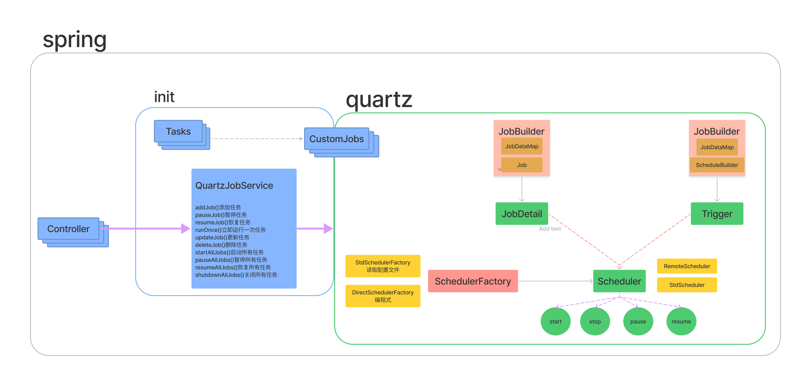
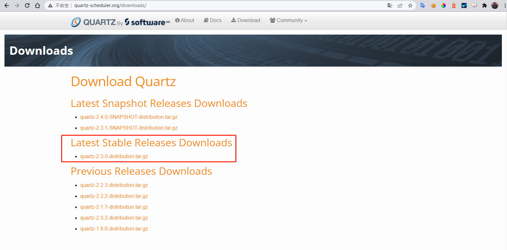
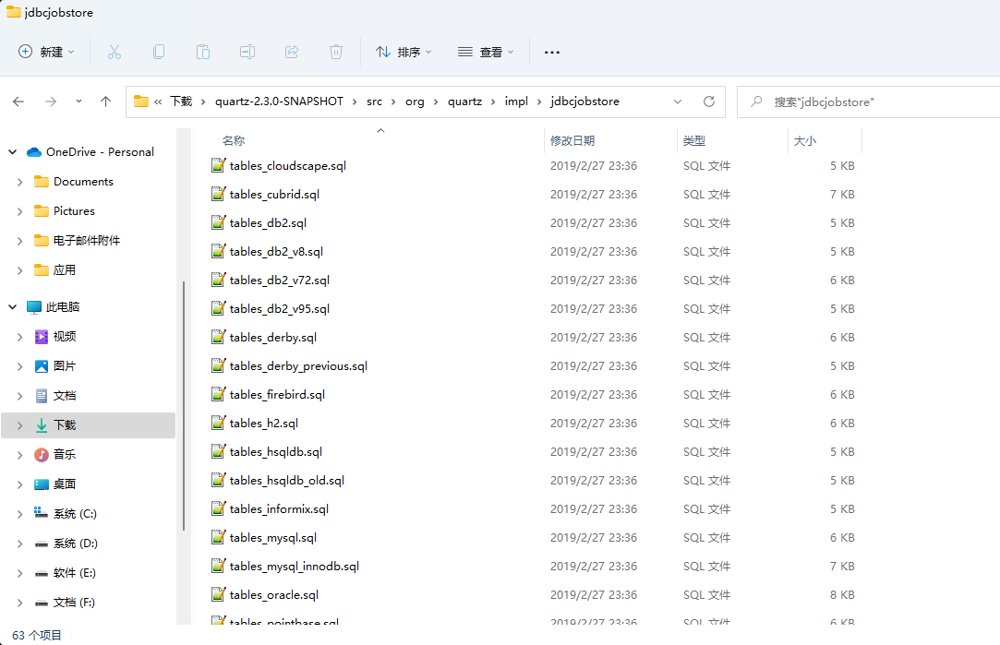

# springboot整合quartz支持集群环境

## 背景

我们的各个服务需要改造支持集群，现在的授权、日程使用的是基于内存的spring scheduler定时任务，如果部署多个节点，那么到了时间点，多个节点都会开始执行定时任务从而可能引起业务和性能上的问题。

服务中的定时任务比较轻量，为了避免引入redis、zookeeper、单独的定时任务程序，所以建议选用quartz这种基于数据库的分布式定时任务调度框架，无需引用多余中间件。


## 简单设计

## 开始集成quartz

1. 在[官网下载quartz](http://www.quartz-scheduler.org/downloads/)

   

2. 下载之后解压，进入`src\org\quartz\impl\jdbcjobstore`找到22种数据库11张表的初始化sql文件，我们使用的数据库主要为pg系，所以需要使用`tables_postgres.sql`(达梦为Oracle系，需要使用`tables_oracle.sql`)

   

   11张表的功能说明：

   |           表名           |                             功能                             |
      | :----------------------: | :----------------------------------------------------------: |
   |     qrtz_job_details     |              存储每一个已配置的 Job 的详细信息               |
   |      qrtz_triggers       |                 存储已配置的 Trigger 的信息                  |
   |   qrtz_simple_triggers   |    存储简单的 Trigger，包括重复次数，间隔，以及已触的次数    |
   |    qrtz_cron_triggers    |        存储 Cron Trigger，包括 Cron 表达式和时区信息         |
   |  qrtz_simprop_triggers   |    存储简单的 Trigger，包括重复次数，间隔，以及已触的次数    |
   |    qrtz_blob_triggers    | Trigger 作为 Blob 类型存储(用于 Quartz 用户用 JDBC 创建他们自己定制的 Trigger 类型，JobStore 并不知道如何存储实例的时候) |
   |      qrtz_calendars      |           以 Blob 类型存储 Quartz 的 Calendar 信息           |
   | qrtz_paused_trigger_grps |                存储已暂停的 Trigger 组的信息                 |
   |   qrtz_fired_triggers    | 存储与已触发的 Trigger 相关的状态信息，以及相联 Job 的执行信息 |
   |   qrtz_scheduler_state   | 存储少量的有关 Scheduler 的状态信息，和别的 Scheduler 实例(假如是用于一个集群中) |
   |        qrtz_locks        |           存储程序的悲观锁的信息(假如使用了悲观锁)           |


3. 引入依赖

   ```xml
   <!--quartz依赖 -->
   <dependency>
       <groupId>org.springframework.boot</groupId>
       <artifactId>spring-boot-starter-quartz</artifactId>
   </dependency>
   ```


4. springboot集成quartz核心配置类

    - 初始化quartz：`QuartzConfigure.java`

   ```java
   @Configuration
   public class QuartzConfigure {
   
       /**
        * quartz配置文件路径
        */
       private static final String QUARTZ_CONFIG = "/quartz.properties";
   
       /**
        * JobFactory与schedulerFactoryBean中的JobFactory相互依赖,注意bean的名称
        * 在这里为JobFactory注入了Spring上下文
        *
        * @param applicationContext
        * @return
        */
       @Bean
       public JobFactory customJobFactory(ApplicationContext applicationContext) {
           QuartzJobFactory jobFactory = new QuartzJobFactory();
           jobFactory.setApplicationContext(applicationContext);
           return jobFactory;
       }
   
       @Bean
       public SchedulerFactoryBean schedulerFactoryBean(JobFactory customJobFactory, DataSource dataSource) throws IOException {
           // 创建SchedulerFactoryBean
           SchedulerFactoryBean factory = new SchedulerFactoryBean();
           factory.setQuartzProperties(quartzProperties());
           // 支持在JOB实例中注入其他的业务对象
           factory.setJobFactory(customJobFactory);
           factory.setApplicationContextSchedulerContextKey("applicationContextKey");
           // 这样当spring关闭时，会等待所有已经启动的quartz job结束后spring才能完全shutdown。
           factory.setWaitForJobsToCompleteOnShutdown(true);
           // 是否覆盖己存在的Job
           factory.setOverwriteExistingJobs(false);
           // QuartzScheduler 延时启动，应用启动完后 QuartzScheduler 再启动
           factory.setStartupDelay(10);
           // 注入spring维护的DataSource
           factory.setDataSource(dataSource);
           return factory;
       }
   
       /**
        * 从quartz.properties文件中读取Quartz配置属性
        *
        * @return
        * @throws IOException
        */
       @Bean
       public Properties quartzProperties() throws IOException {
           PropertiesFactoryBean propertiesFactoryBean = new PropertiesFactoryBean();
           propertiesFactoryBean.setLocation(new ClassPathResource(QUARTZ_CONFIG));
           propertiesFactoryBean.afterPropertiesSet();
           return propertiesFactoryBean.getObject();
       }
   
       /**
        * 通过SchedulerFactoryBean获取Scheduler的实例
        *
        * @return
        * @throws IOException
        */
       @Bean(name = "scheduler")
       public Scheduler scheduler(JobFactory customJobFactory, DataSource dataSource) throws IOException {
           return schedulerFactoryBean(customJobFactory, dataSource).getScheduler();
       }
   
   }
   ```

    - 注入SpringBean：`QuartzJobFactory.java`

   ```java
   /**
    * 为JobFactory注入SpringBean,否则Job无法使用Spring创建的bean
    * 
    * @author Ric
    */
   @Component
   public class QuartzJobFactory extends AdaptableJobFactory implements ApplicationContextAware {
   
       @Autowired
       private AutowireCapableBeanFactory capableBeanFactory;
   
       @Override
       @NonNull
       protected Object createJobInstance(@NonNull TriggerFiredBundle bundle) throws Exception {
           // 调用父类的方法
           Object jobInstance = super.createJobInstance(bundle);
           // 进行注入
           capableBeanFactory.autowireBean(jobInstance);
           return jobInstance;
       }
   
       @Override
       public void setApplicationContext(ApplicationContext applicationContext) throws BeansException {
           capableBeanFactory = applicationContext.getAutowireCapableBeanFactory();
       }
   }
   ```

    - 具体的定时任务：`CustomJob.java`

   ```java
   /**
    * @DisallowConcurrentExecution : 此标记用在实现Job的类上面,意思是不允许并发执行.
    * 注org.quartz.threadPool.threadCount的数量有多个的情况,@DisallowConcurrentExecution才生效
    */
   @DisallowConcurrentExecution
   public class CustomJob implements Job{
       private static final Logger logger = LoggerFactory.getLogger(CustomJob.class);
   
       /**
        * 核心方法,Quartz Job真正的执行逻辑.
        * @param context 中封装有Quartz运行所需要的所有信息
        * @throws JobExecutionException execute()方法只允许抛出JobExecutionException异常
        */
   	@Override
   	public void execute(JobExecutionContext context) throws JobExecutionException {
   		logger.info("--------------定时任务执行逻辑---------------------");
   	}
   }
   ```

    - 定义操作任务的统一接口：`QuartzJobService.java`

   ```java
   public interface QuartzJobService {
       /**
        * 添加任务可以传参数
        *
        * @param clazzName 继承自Job的类，例如：work.lichong.quartzdemo.solution.one.job.CustomJob
        * @param jobName   任务名称
        * @param groupName 任务组
        * @param cronExp   cron表达式
        * @param param     JobDataMap的参数
        */
       void addJob(String clazzName, String jobName, String groupName, String cronExp, Map<String, Object> param);
   
       /**
        * 暂停任务
        *
        * @param jobName   任务名称
        * @param groupName 任务组
        */
       void pauseJob(String jobName, String groupName);
   
       /**
        * 恢复任务
        *
        * @param jobName   任务名称
        * @param groupName 任务组
        */
       void resumeJob(String jobName, String groupName);
   
       /**
        * 立即运行一次定时任务
        *
        * @param jobName   任务名称
        * @param groupName 任务组
        */
       void runOnce(String jobName, String groupName);
   
       /**
        * 更新任务
        *
        * @param jobName   任务名称
        * @param groupName 任务组
        * @param cronExp   cron表达式
        * @param param     JobDataMap的参数
        */
       void updateJob(String jobName, String groupName, String cronExp, Map<String, Object> param);
   
       /**
        * 删除任务
        *
        * @param jobName   任务名称
        * @param groupName 任务组
        */
       void deleteJob(String jobName, String groupName);
   
       /**
        * 启动所有任务
        */
       void startAllJobs();
   
       /**
        * 暂停所有任务
        */
       void pauseAllJobs();
   
       /**
        * 恢复所有任务
        */
       void resumeAllJobs();
   
       /**
        * 关闭所有任务
        */
       void shutdownAllJobs();
   }
   ```

    - 具体实现：`QuartzJobServiceImpl.java`

   ```java
   @Service
   @Slf4j
   public class QuartzJobServiceImpl implements QuartzJobService {
   
       @Autowired
       private Scheduler scheduler;
   
       @Override
       public void addJob(String clazzName, String jobName, String groupName, String cronExp, Map<String, Object> param) {
           try {
               // 启动调度器，默认初始化的时候已经启动
               // scheduler.start();
               // 构建job信息
               Class<? extends Job> jobClass = (Class<? extends Job>) Class.forName(clazzName);
               JobDetail jobDetail = JobBuilder.newJob(jobClass).withIdentity(jobName, groupName).build();
               // 表达式调度构建器(即任务执行的时间)
               CronScheduleBuilder scheduleBuilder = CronScheduleBuilder.cronSchedule(cronExp);
               // 按新的cronExpression表达式构建一个新的trigger
               CronTrigger trigger = TriggerBuilder.newTrigger().withIdentity(jobName, groupName).withSchedule(scheduleBuilder).build();
               // 获得JobDataMap，写入数据
               if (param != null) {
                   trigger.getJobDataMap().putAll(param);
               }
               scheduler.scheduleJob(jobDetail, trigger);
           } catch (ObjectAlreadyExistsException e) {
               log.warn("{}组下的{}任务已存在，创建失败", groupName, jobName);
           } catch (Exception e) {
               log.error("创建任务失败", e);
           }
       }
   
       @Override
       public void pauseJob(String jobName, String groupName) {
           try {
               scheduler.pauseJob(JobKey.jobKey(jobName, groupName));
           } catch (SchedulerException e) {
               log.error("暂停任务失败", e);
           }
       }
   
       @Override
       public void resumeJob(String jobName, String groupName) {
           try {
               scheduler.resumeJob(JobKey.jobKey(jobName, groupName));
           } catch (SchedulerException e) {
               log.error("恢复任务失败", e);
           }
       }
   
       @Override
       public void runOnce(String jobName, String groupName) {
           try {
               scheduler.triggerJob(JobKey.jobKey(jobName, groupName));
           } catch (SchedulerException e) {
               log.error("立即运行一次定时任务失败", e);
           }
       }
   
       @Override
       public void updateJob(String jobName, String groupName, String cronExp, Map<String, Object> param) {
           try {
               TriggerKey triggerKey = TriggerKey.triggerKey(jobName, groupName);
               CronTrigger trigger = (CronTrigger) scheduler.getTrigger(triggerKey);
               if (cronExp != null) {
                   // 表达式调度构建器
                   CronScheduleBuilder scheduleBuilder = CronScheduleBuilder.cronSchedule(cronExp);
                   // 按新的cronExpression表达式重新构建trigger
                   trigger = trigger.getTriggerBuilder().withIdentity(triggerKey).withSchedule(scheduleBuilder).build();
               }
               // 修改map
               if (param != null) {
                   trigger.getJobDataMap().putAll(param);
               }
               // 按新的trigger重新设置job执行
               scheduler.rescheduleJob(triggerKey, trigger);
           } catch (Exception e) {
               log.error("更新任务失败", e);
           }
       }
   
       @Override
       public void deleteJob(String jobName, String groupName) {
           try {
               // 暂停、移除、删除
               scheduler.pauseTrigger(TriggerKey.triggerKey(jobName, groupName));
               scheduler.unscheduleJob(TriggerKey.triggerKey(jobName, groupName));
               scheduler.deleteJob(JobKey.jobKey(jobName, groupName));
           } catch (Exception e) {
               log.error("删除任务失败", e);
           }
       }
   
       @Override
       public void startAllJobs() {
           try {
               scheduler.start();
           } catch (Exception e) {
               log.error("开启所有的任务失败", e);
           }
       }
   
       @Override
       public void pauseAllJobs() {
           try {
               scheduler.pauseAll();
           } catch (Exception e) {
               log.error("暂停所有任务失败", e);
           }
       }
   
       @Override
       public void resumeAllJobs() {
           try {
               scheduler.resumeAll();
           } catch (Exception e) {
               log.error("恢复所有任务失败", e);
           }
       }
   
       @Override
       public void shutdownAllJobs() {
           try {
               if (!scheduler.isShutdown()) {
                   // 需谨慎操作关闭scheduler容器
                   // scheduler生命周期结束，无法再 start() 启动scheduler
                   scheduler.shutdown(true);
               }
           } catch (Exception e) {
               log.error("关闭所有的任务失败", e);
           }
       }
   }
   ```

    - quartz的配置文件

   ```properties
   #===================================================================
   # 配置JobStore
   #===================================================================
   # 数据保存方式为数据库持久化
   org.quartz.jobStore.class=org.springframework.scheduling.quartz.LocalDataSourceJobStore
   # 数据库代理类，一般org.quartz.impl.jdbcjobstore.StdJDBCDelegate可以满足大部分数据库，建议pg系使用PostgreSQLDelegate，oracle系使用OracleDelegate
   org.quartz.jobStore.driverDelegateClass=org.quartz.impl.jdbcjobstore.PostgreSQLDelegate
   # 表的前缀，默认QRTZ_
   org.quartz.jobStore.tablePrefix=QRTZ_
   # 是否加入集群
   org.quartz.jobStore.isClustered=true
   # 信息保存时间 默认值60秒 单位：ms
   org.quartz.jobStore.misfireThreshold=25000
   # 调度实例失效的检查时间间隔 ms
   org.quartz.jobStore.clusterCheckinInterval = 5000
   # JobDataMaps是否都为String类型，默认false
   org.quartz.jobStore.useProperties=false
   # 当设置为“true”时，此属性告诉Quartz 在非托管JDBC连接上调用setTransactionIsolation（Connection.TRANSACTION_READ_COMMITTED）。
   org.quartz.jobStore.txIsolationLevelReadCommitted = true
   #===================================================================
   # Scheduler 调度器属性配置
   #===================================================================
   # 调度标识名 集群中每一个实例都必须使用相同的名称
   org.quartz.scheduler.instanceName=DefaultTapClusterScheduler
   # ID设置为自动获取 每一个必须不同
   org.quartz.scheduler.instanceId=AUTO
   # 是否开启守护线程
   org.quartz.scheduler.makeSchedulerThreadDaemon=true
   #===================================================================
   # 配置ThreadPool
   #===================================================================
   # 线程池的实现类（一般使用SimpleThreadPool即可满足需求）
   org.quartz.threadPool.class=org.quartz.simpl.SimpleThreadPool
   # 指定在线程池里面创建的线程是否是守护线程
   org.quartz.threadPool.makeThreadsDaemons=true
   # 指定线程数，至少为1（无默认值），一般设置为1-100直接的整数，根据系统资源配置
   org.quartz.threadPool.threadCount=5
   # 设置线程的优先级（最大为java.lang.Thread.MAX_PRIORITY 10，最小为Thread.MIN_PRIORITY 1，默认为5）
   org.quartz.threadPool.threadPriority=5
   ```


5. 在CustomJob等Job中写自己的定时任务业务逻辑，可以把这部分业务代码再抽象出来就和quartz解耦了


## 总结
配置太麻烦，有一点学习成本，还有一种无脑的ShedLock方案可以研究一下

